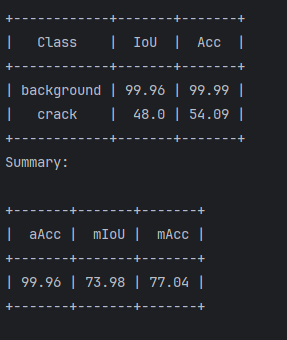
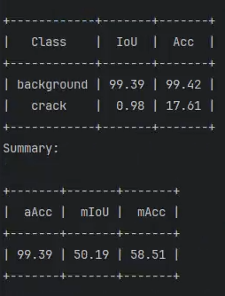
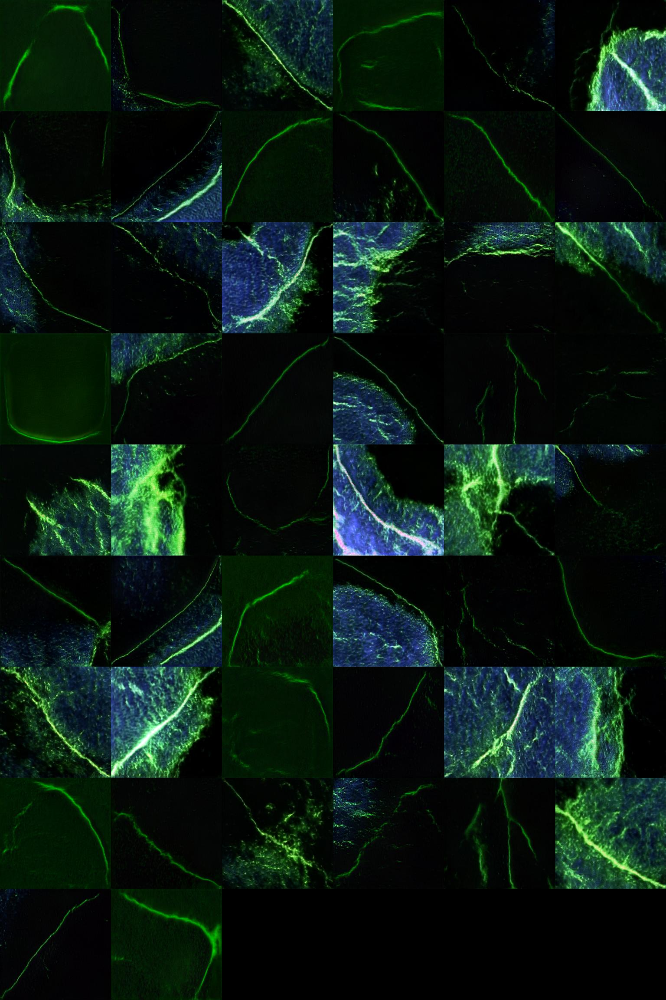

# 26.2.7模型训练结果
- 训练结果保存在0204_train中
- 
- 切分的小图测试集结果保存在saves中，compare文件夹是与标签对比结果，半透明红色为标注标签，绿色为推理结果
- 大图推理结果在saves/fulldata中，**效果很差**，使用的是天润20260120标注，天润裂纹20251124标注，天润裂纹20251111标注三个数据，共458张图，太大就上传到阿里云了，链接：https://pan.baidu.com/s/19u43tYEqxYalq2UWyndf-w?pwd=1234 提取码: 1234 
- 

# 模拟裂纹生成
- 可生成纺锤型、蝌蚪型、波浪型树状裂纹,坑状裂纹初步完成--26.2.4
- 使用mmgeneration生成模拟裂纹，效果如Crack_mmgenfake文件夹下所示
  - 配置文件为stylegan2_c2_ffhq_256_b4x8_800k_strawberry.py,评估Inception V3模型训练权重为crack.pkl
  - 权重链接：https://pan.xunlei.com/s/VOlVEIP7mqDUNwzd6BEl4bdfA1?pwd=g98g#
- 

# 文件结构--26.1.30
0123_t0_result  # t0表示每处IOU阈值大于0即判定为预测正确
- correct 11+691=702  # 评价为正确的结果，命名格式为：预测结果_有gt标签的_没有gt标签的_总数
  - with_gt  # 有对应gt标签的预测结果
    - correct_面阵_2_2_2_20260105175319_NG.png
    - correct_面阵_2_2_2_20260109151857_NG.png
    - correct_面阵_2_2_2_20260114135523_OK.png
    - ......
  - correct_面阵_2_2_2_20260114131629_OK.png  # 没有对应gt标签的预测结果
  - correct_面阵_2_2_2_20260114132055_OK.png
  - ……
- miss: 11-0=11
- wrong: 8+496=514
- wrong_and_miss: 19+0=19

## xlsx文件记录
预测标签的文件名，预测的裂纹数量，是否存在gt标签，gt标签中标注的裂纹数量，评价结果

## 评价结果
- 正确: correct
- 误检: wrong
- 漏检: miss
- 既存在误检也存在漏检: wrong_miss

